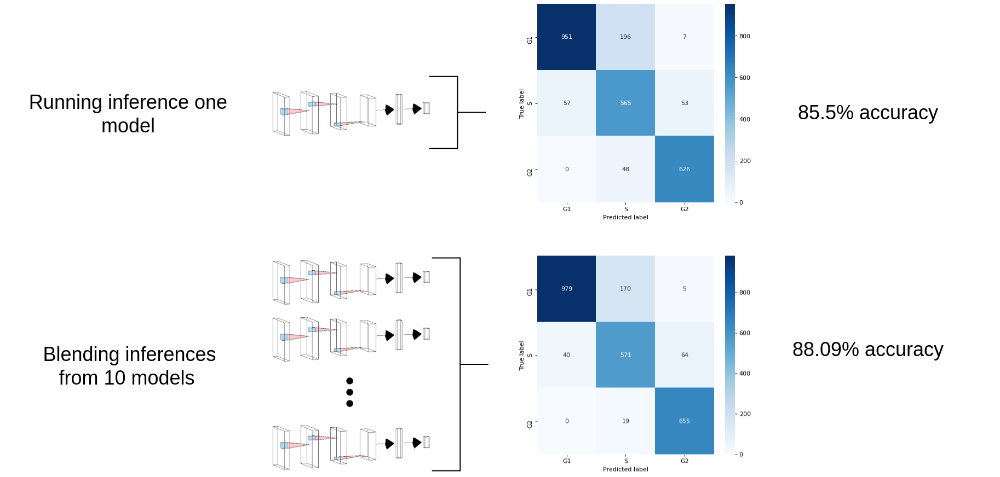

# project-jurkat
### Work in progress
PyTorch + images of human T lymphocyte cells (Jurkat cells)

[](https://nbviewer.jupyter.org/github/Mainakdeb/project-jurkat/)


The aim of this project was to train a PyTorch based Deep Convolutional neural network to classify cell cycle stages of jurkat cells from image data, and then gain insights on the cell cycle process using the trained model and UMAP projections of the predictions.

## The Data:


The dataset contains 3 folders of images belonging to 3 different classes. The number of samples belonging to each class was not balanced, so I had to oversample the minority classes.


The images of different classes were stored in different folders already, instead of using ```torchvision.datasets.ImageFolder```, I decided to generate a csv file with columns containing image paths and their corresponding classes. This also enabled me to implement K-Fold cross validation later down the line, but this came with the added trouble of defining a custom dataset class and a custom dataloader, which I did eventually.

## Inference Blending:
I trained 10 models, on 10 seperate folds of data. Blending the inferences of these 10 models led to a better overall accuracy, the results are highlighted below. 




The trained model was successfully able to capture the gradual nature of the process, even though the labels were not gradual, the UMAP projection of the predictions (on a test set) highlights this outcome.
